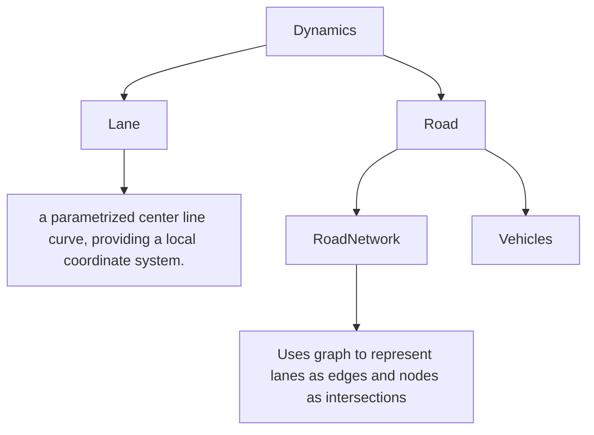
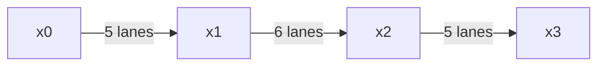
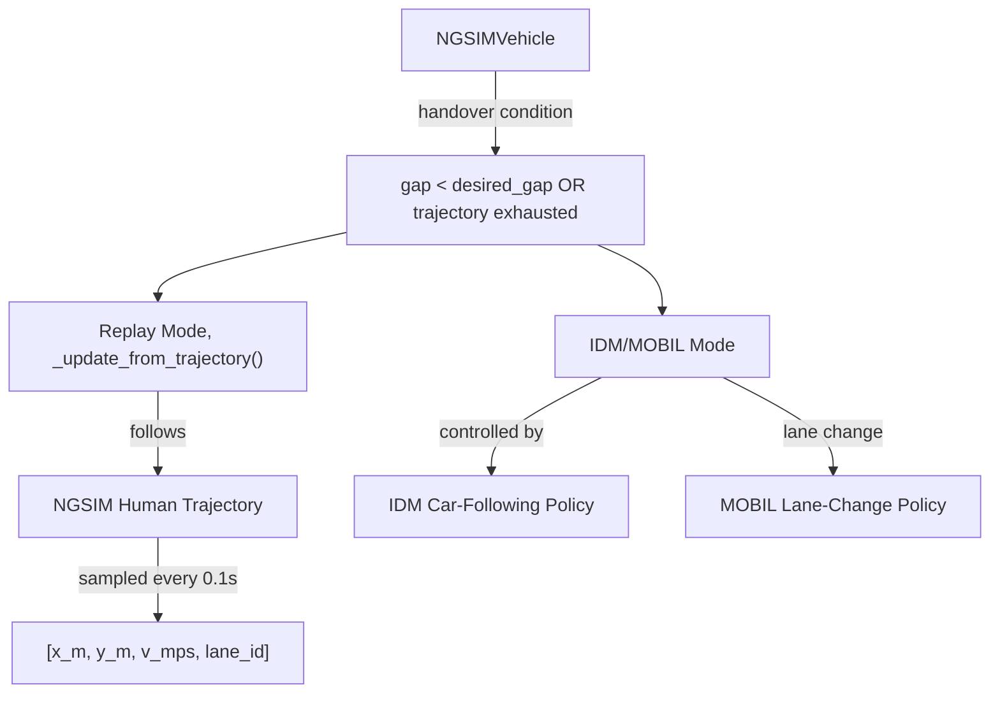
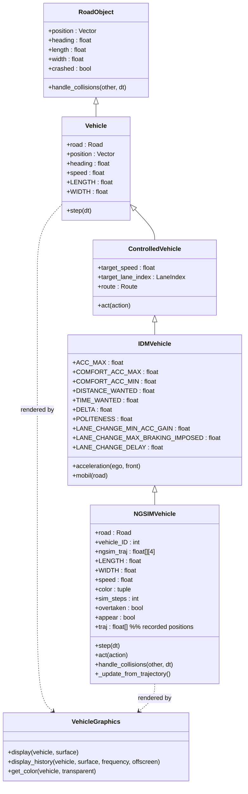

### 1. Todo
#### 1.1. Demonstration of concepts
- [x] Set up the newest highway-env environment.
- [x] Set up the ngsim data and process it.
- [x] Set up a prototype NGSIM Environment for development 
- [x] Document existing Code and how it works. 
#### 1.2. Training Environment Implementation
- [x] Set up templates for trajectory replay. (Due: 27th Oct 2025)
- [x] Trajectory Replay Optimization
    - [x] Issue with the interpolation?
    - [x] Issue with topology?  
- [x] Fix the crashing and jumble issue, create a dataset (Due: 27th Oct 2025)
- [ ] Document the trajectory replay. (Due: 27th Oct 2025)
- [x] Incoorporate IDM into the trajectory replay. (Due: 28th Oct 2025)
- [x] Optimize the training environment and ensure the discovered errors are fixed. 
    - [x] Some car too close to the edge.
    - [ ] IDM when activated change color.
    - [x] Spawn the car in the middle of the traffic.  

##### 1.2.1. NGSIM Data
- [ ] IRL using the NGSIM data on a set of target vehicles. 
    - [ ] Design Rewards based on the weight collected through IRL. 
- [ ] Fine-tune IDM on the NGSIM data. 
- [ ] Train the American Driving Model. 

##### 1.2.2. Japanese Data
- [ ] Understand the Japanese Data, data quality.
- [ ] Preprocess the Japanese Data.
- [ ] IRL using the Japanese data on a set of target vehicles. 
    - [ ] Design Rewards based on the weight collected through IRL. 
- [ ] Fine-tune IDM on the Japanese data. 
- [ ] Train the Japanese Driving Model. 
### 2. Technical Notes
#### 2.1. Tips and Tricks
- [IRL-Drivingg](https://github.com/MCZhi/Driving-IRL-NGSIM/tree/main), uses NGSIM (Europe CSV Data)

#### 2.2. Road and Lanes
##### 2.2.1. Highway-Env API Structure

##### 2.2.2. Road Networks

**2.2.2.1. Data Pre-processing**


**2.2.2.2. Topology Developement**
```python
net = RoadNetwork()

C, S, N = LineType.CONTINUOUS_LINE, LineType.STRIPED, LineType.NONE
```
- `RoadNetwork()` class holds nodes and directed lane edges through sample functions such as `add_lane(from_noce, to_node, lane)`.
- `LineType` controls how the left/right boundaries of a lane are drawn and hence constrained (Allow for change lane etc).

```python
x0 = 0.0
x1 = 560 * ft
x2 = (698 + 578 + 150) * ft
x3 = length
```

- Here we split the roadway into three longitudinal sections where each sections are connected using different numbers of lanes. 
-  The main road consist of 5 parrallel lanes and the connection between `x1` and `x2` contains two slopes (on and off).

```python
##########################################
#-------------- Section 1 ----------------#
##########################################
line_types_5 = [
    (C, N),   # lane 0: solid line on its outside-left edge
    (S, N),
    (S, N),
    (S, N),
    (S, C),   # lane 4: solid line on its outside-right edge
]
for i, lt in enumerate(line_types_5):
    start = [x0, i * lane_width]
    end   = [x1, i * lane_width]
    net.add_lane("s1", "s2", StraightLane(start, end, width=lane_width, line_types=lt, speed_limit=33.3))
```
- Each of the parrallel straight lanes would need a left edge and a right edge, defined using `(left_edge, right_edge)`
- As defined previously each of the abbreviations `[C, S, N]` would be associated with a different connotation. 
    - `C`: CONTINUOUS_LINE (solid; usually no crossing allowed).
    - `S`: STRIPED (dashed; lane changes allowed).
    - `N`: NONE (no drawn line—used at the interior where left/right is shared or not shown)

```python
################################################
#-------------- RAMP Connector ----------------#
################################################
net.add_lane(
    "onramp", "s2",
    StraightLane([480 * ft, 5.5 * lane_width], [x1, 5 * lane_width],
                 width=lane_width, line_types=(C, C), forbidden=True, priority=-1, speed_limit=25.0)
)
```
- A short ramp lane from the "onramp" node into the right side of the mainline near x1.
- Starts a little above lane 5’s centerline (y = 5.5 * lane_width) and merges to the rightmost mainline lane (y = 5 * lane_width) at x1.
- ego vehicle is not allowed to use this particular lane. 
```python
###########################################
#-------------- Section 2 ----------------#
###########################################

line_types_6 = [(C, N), (S, N), (S, N), (S, N), (S, N), (S, C)]
for i, lt in enumerate(line_types_6):
    start = [x1, i * lane_width]
    end   = [x2, i * lane_width]
    net.add_lane("s2", "s3", StraightLane(start, end, width=lane_width, line_types=lt, speed_limit=33.3))
Same idea as Section 1, but now there are 6 lanes (index 0..5).
```
- Same as section 1 but with 6 Lanes. 

```python
###########################################
#-------------- Section 3 ----------------#
###########################################

for i, lt in enumerate(line_types_5):
    start = [x2, i * lane_width]
    end   = [x3, i * lane_width]
    net.add_lane("s3", "s4", StraightLane(start, end, width=lane_width, line_types=lt, speed_limit=33.3))
```
- Same as section 1, going back to 5 Lanes. 

```python
##############################################
#-------------- RAMP Connector ----------------#
##############################################
net.add_lane(
    "s3", "offramp",
    StraightLane([x2, 5 * lane_width], [1550 * ft, 7 * lane_width],
                 width=lane_width, line_types=(C, C), forbidden=True, priority=-1, speed_limit=25.0)
)
```
- Finalise the lanes. 
#### 2.3. NGSIM Environment

#### 2.4. NGSIM Vehicles
**2.4.1. NGSIM Vehicle Functions**

- The contructed NGSIM Vehicle class has two modes, the Replay Mode and the IDM/MOBIL Mode. 
- The key input we need to provide to the Vehicle class is the `ngsim_traj` variable which composes of `[x_m, y_m, v_mps, lane_id]`. 
    - `x_m`: the vehicle’s x-coordinate in the road/world frame at that time.
    - `y_m`: the vehicle’s y-coordinate in the same frame.
    - `v_mps`: the vehicle’s instantaneous speed recorded in the dataset at that time.
    - `lane_id`: which NGSIM lane the vehicle is in at that time step, e.g. lane 1–5 for mainline, 6–8 for on-ramp / off-ramp / aux lane.
- The simulator will replay human trajectory if the distance between the NGSIM Vehicle and front vehicle is greater than a certain value. Else, IDM will take over. 

**2.4.2. Vehicle Class Inheritance** 



### 3. Reference Materials
- https://github.com/MCZhi/Driving-IRL-NGSIM/tree/main
- https://github.com/Farama-Foundation/HighwayEnv