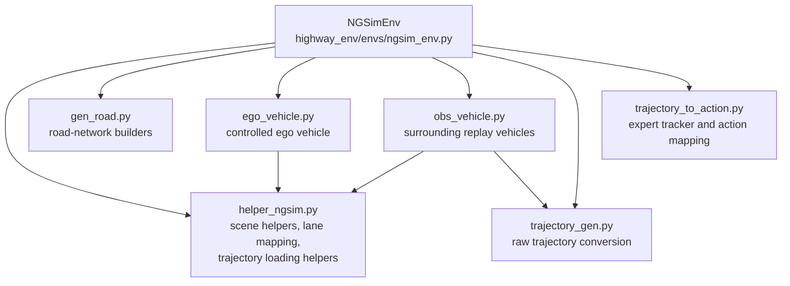
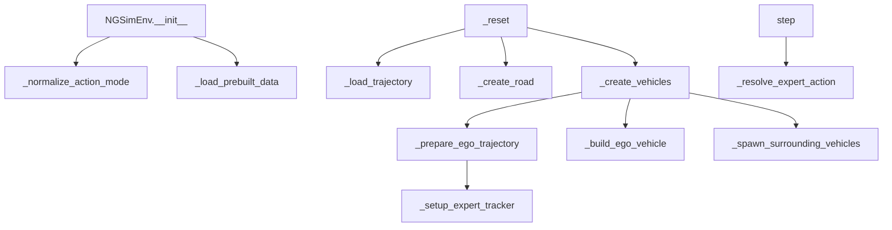
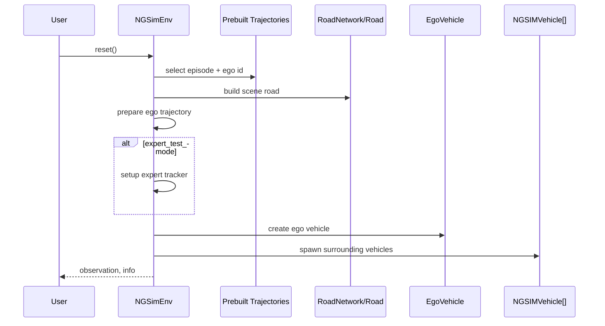
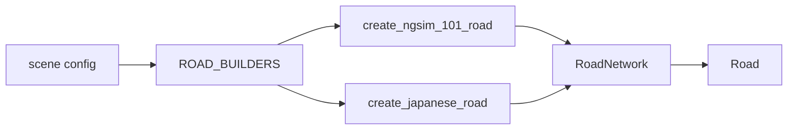
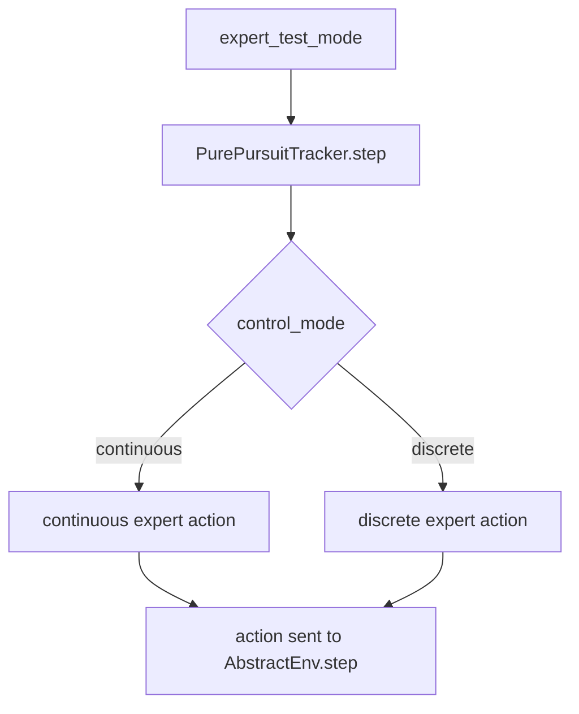
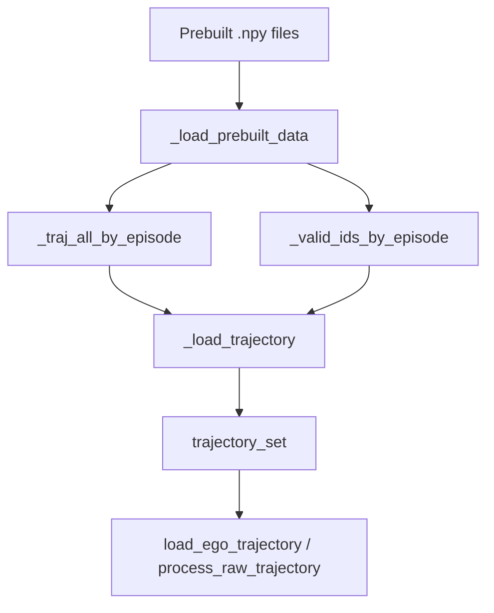

# NGSimEnv Structure

This note describes how [`NGSimEnv`](/home/tao/Documents/Github_Projects/HighwayEnv-NGSIM/highway_env/envs/ngsim_env.py) is organized and how it interacts with the utilities in [`highway_env/ngsim_utils`](/home/tao/Documents/Github_Projects/HighwayEnv-NGSIM/highway_env/ngsim_utils).

## High-Level Layout

`NGSimEnv` is the main environment class. It is responsible for:

- loading prebuilt trajectory episodes
- selecting an episode and ego vehicle
- building the road for the selected scene
- spawning the ego vehicle and surrounding replay vehicles
- optionally running in `expert_test_mode`, where expert actions override external actions
- stepping the simulation and returning observations/info

## Main Modules



## NGSimEnv Responsibilities



## Reset Lifecycle

The reset path builds a fresh simulation state from recorded data.



## Step Lifecycle

The environment supports two modes:

- normal mode: the caller-provided action is used
- `expert_test_mode`: the expert action is computed internally and replaces the caller-provided action

```mermaid
flowchart TD
    A[step(action)]
    B{expert_test_mode?}
    C[_resolve_expert_action]
    D[super().step(action)]
    E[road.act + road.step]
    F[obs/reward/terminated/truncated/info]
    G[attach expert info to info dict]

    A --> B
    B -- Yes --> C
    B -- No --> D
    C --> D
    D --> E
    E --> F
    F --> G
```

## Scene and Road Selection

Road creation is scene-driven.



Current scene-related responsibilities:

- [`gen_road.py`](/home/tao/Documents/Github_Projects/HighwayEnv-NGSIM/highway_env/ngsim_utils/gen_road.py): builds road topology
- [`helper_ngsim.py`](/home/tao/Documents/Github_Projects/HighwayEnv-NGSIM/highway_env/ngsim_utils/helper_ngsim.py): maps `x` and dataset `lane_id` to valid road edges/lane indices

## Vehicle Roles

### EgoVehicle

[`EgoVehicle`](/home/tao/Documents/Github_Projects/HighwayEnv-NGSIM/highway_env/ngsim_utils/ego_vehicle.py) is the controlled vehicle used by the environment.

It supports:

- continuous low-level control
- discrete meta-actions
- lane-change cooldown and within-lane offset control
- scene-aware lane projection using road-edge helpers

### NGSIMVehicle

[`NGSIMVehicle`](/home/tao/Documents/Github_Projects/HighwayEnv-NGSIM/highway_env/ngsim_utils/obs_vehicle.py) is used for surrounding vehicles.

It supports:

- replaying logged trajectories
- appearing/disappearing from logged data
- replay-time lane assignment using recorded `lane_id`
- IDM/MOBIL handover when replay ends or replay becomes unsafe

## Expert Mode

In `expert_test_mode`, `NGSimEnv` computes an expert action each step using:

- [`setup_expert_tracker()`](/home/tao/Documents/Github_Projects/HighwayEnv-NGSIM/highway_env/ngsim_utils/helper_ngsim.py#L133)
- [`PurePursuitTracker`](/home/tao/Documents/Github_Projects/HighwayEnv-NGSIM/highway_env/ngsim_utils/trajectory_to_action.py)
- [`map_discrete_expert_action()`](/home/tao/Documents/Github_Projects/HighwayEnv-NGSIM/highway_env/ngsim_utils/trajectory_to_action.py)



Important design note:

- In `expert_test_mode`, external actions are deliberately ignored so the environment can test expert-action generation and replay quality directly.

## Supporting Data Flow



## Key Files

- [`ngsim_env.py`](/home/tao/Documents/Github_Projects/HighwayEnv-NGSIM/highway_env/envs/ngsim_env.py): main environment orchestration
- [`helper_ngsim.py`](/home/tao/Documents/Github_Projects/HighwayEnv-NGSIM/highway_env/ngsim_utils/helper_ngsim.py): lane mapping and helper utilities
- [`gen_road.py`](/home/tao/Documents/Github_Projects/HighwayEnv-NGSIM/highway_env/ngsim_utils/gen_road.py): road builders
- [`ego_vehicle.py`](/home/tao/Documents/Github_Projects/HighwayEnv-NGSIM/highway_env/ngsim_utils/ego_vehicle.py): ego control logic
- [`obs_vehicle.py`](/home/tao/Documents/Github_Projects/HighwayEnv-NGSIM/highway_env/ngsim_utils/obs_vehicle.py): surrounding replay vehicles
- [`trajectory_gen.py`](/home/tao/Documents/Github_Projects/HighwayEnv-NGSIM/highway_env/ngsim_utils/trajectory_gen.py): trajectory conversion
- [`trajectory_to_action.py`](/home/tao/Documents/Github_Projects/HighwayEnv-NGSIM/highway_env/ngsim_utils/trajectory_to_action.py): expert tracking/action conversion

## Suggested Reading Order

1. [`ngsim_env.py`](/home/tao/Documents/Github_Projects/HighwayEnv-NGSIM/highway_env/envs/ngsim_env.py)
2. [`helper_ngsim.py`](/home/tao/Documents/Github_Projects/HighwayEnv-NGSIM/highway_env/ngsim_utils/helper_ngsim.py)
3. [`gen_road.py`](/home/tao/Documents/Github_Projects/HighwayEnv-NGSIM/highway_env/ngsim_utils/gen_road.py)
4. [`ego_vehicle.py`](/home/tao/Documents/Github_Projects/HighwayEnv-NGSIM/highway_env/ngsim_utils/ego_vehicle.py)
5. [`obs_vehicle.py`](/home/tao/Documents/Github_Projects/HighwayEnv-NGSIM/highway_env/ngsim_utils/obs_vehicle.py)
6. [`trajectory_to_action.py`](/home/tao/Documents/Github_Projects/HighwayEnv-NGSIM/highway_env/ngsim_utils/trajectory_to_action.py)
